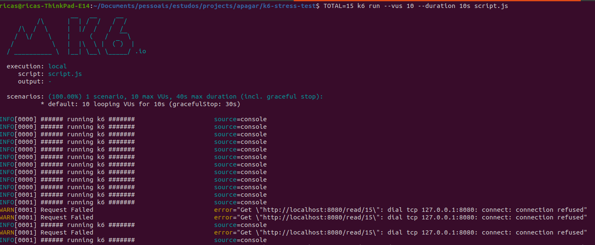
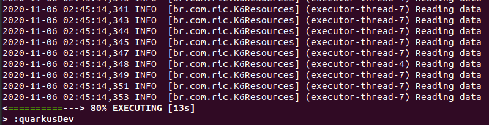
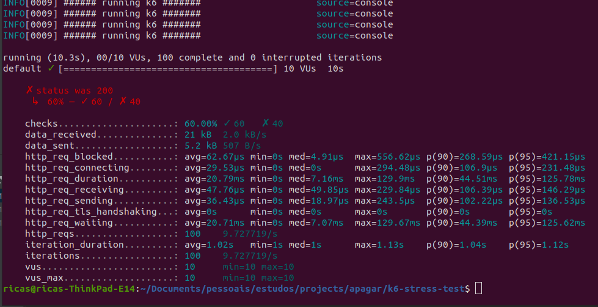

 
 
 


# k6-stress-test

This project was created to simulate the use of the k6 test. There is an endpointthat creates a map with a sequence of integers. After this endpoint is up, scritp.js executes the tests, stressing it according to the variables informed during the run.

## Technologies

- [`Quarkus`](https://quarkus.io/) - Framework
- [`k6`](https://k6.io/) - K6 

## Prerequisites
- [`Jdk11`](https://www.oracle.com/java/technologies/javase-jdk11-downloads.html) - Language

## Running the application in dev mode

```
cd k6-stress-test

./gradlew quarkusDev
```

## Running k6 stress test

```
TOTAL=15 k6 run --vus 10 --duration 30s script.js
```
 - TOTAL = number of iterations that intStream will use to generate map content
 - vus = number of virtual user (k6 documentation)
 - duration = duration of test (k6 documentation)
 
## Understanding results

Running k6 we noticed the log **"running k6"**, but in a moment we started to have error **"request failed"**
this happened on purpose when the application was stopped. Then, we ran the application again and the logs continue

<p align="start">
    
</p>


Quarkus LOGGER will print **"Reading Data"** when the request access the endpoint

<p align="start">
    
</p>

The final k6 results

<p align="start">
    
</p>


